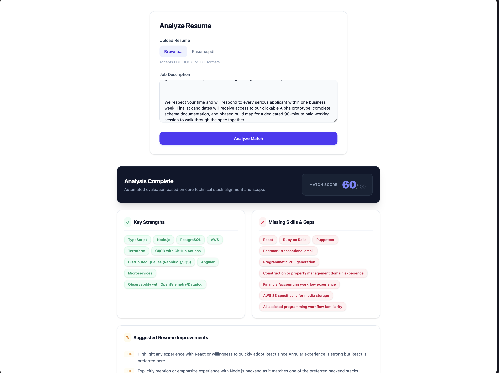
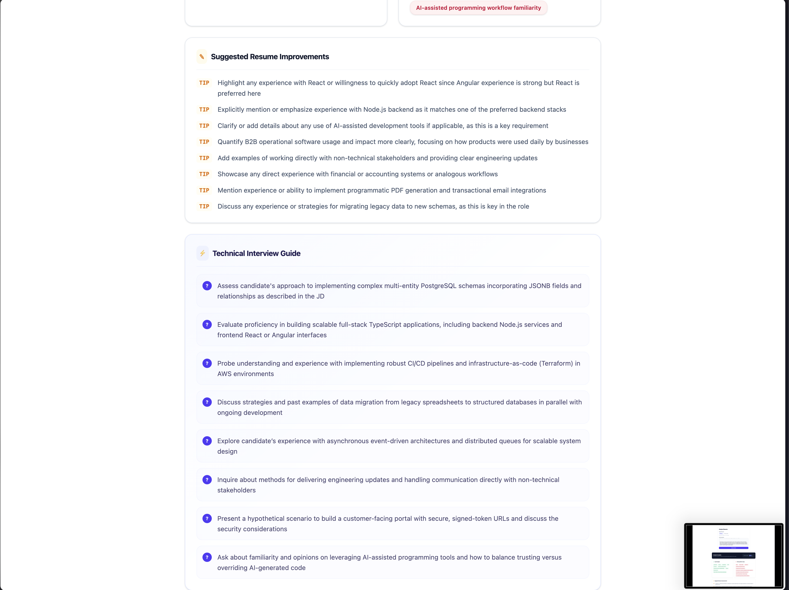

# Resume Analyzer
Resume analyzer is a utlity to tool to analyzes resumes against job descriptions and provide candidates with structred analysis to improves their resume.

## Prerequisites
- Node.js 24

## Installation

```sh
pnpm install
```

## Usage
### Environment Variables
Copy `.env.example` to `.env` and fill in the values
- `OPENAI_API_KEY`: Enter your OpenAI API key here
- `OPENAI_MODEL`: Enter the OpenAI model to use here, default is `gpt-4o-mini`

### Backend
```sh
pnpm nx run backend:serve
```

### Frontend
```sh
pnpm nx run frontend:serve
```

## Tech Stack
- NX (monorepo tooling)
- NestJS (backend)
- Angular (frontend)
- Tailwindcss (styles)

## Screeshots



